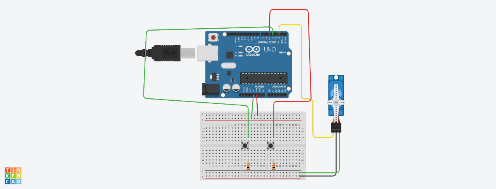

ControleServoMotor
Introdução
Este projeto utiliza um servo motor conectado ao Arduino e um botão para controlar sua posição. Cada vez que o botão é pressionado, o servo motor aumenta sua posição em 1 grau, até um máximo de 180 graus. Esse sistema é útil para aplicações que requerem controle de ângulo preciso.

Componentes Usados
1 Arduino Uno

1 Servo Motor

1 Botão

Jumpers Macho-Macho

Montagem do Circuito

Explicação do Código
cpp
Copiar código
// biblioteca do servo motor
#include <Servo.h>

// criando objeto do tipo servo Motor
Servo objetoservo;

// variável para salvar a porta que o servo está
int servo = 2;
// variavel para porta do botão
int botão = 4;
// variavel para posição do motor
int posição = 0;

void setup()
{
  // inicializando o servo na porta digital 2
  objetoservo.attach(servo);
  // definir botão como entrada
  pinMode(botão, INPUT);
}

void loop()
{
  /* SE BOTÃO FOR PRESSIONADO E POSIÇÃO DO
     SERVO MOTOR ESTIVER MENOR QUE 180° */
  if (digitalRead(botão) == HIGH && posição <= 180) {
    // ENTÃO AUMENTE 1° DE POSIÇÃO
    posição++;
    // MANDE O MOTOR PARA A NOVA POSIÇÃO
    objetoservo.write(posição);
    // AGUARDE 1 SEGUNDO PARA A PRÓXIMA LEITURA
    delay(1000);
  }
}
Definição das Variáveis
objetoservo: Objeto da biblioteca Servo que controla o servo motor.
servo: Pino conectado ao servo motor.
botão: Pino conectado ao botão para leitura de pressão.
posição: Variável que armazena a posição atual do servo motor.
Funções Principais
setup(): Inicializa o servo motor no pino designado e configura o pino do botão como entrada.
loop(): Verifica continuamente se o botão está pressionado. Se estiver e a posição do servo for menor que 180 graus, aumenta a posição em 1 grau e move o servo para essa nova posição.
Este projeto é uma excelente maneira de aprender sobre o controle de servo motores em Arduino. Você pode expandi-lo para incluir múltiplos botões ou diferentes modos de operação.
