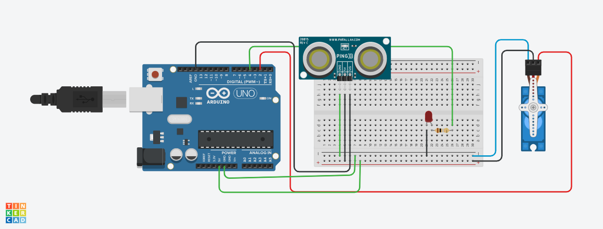

# Robô de segurança

# Introdução

Este projeto foi desenvolvido utilizando a plataforma Arduino, com
o objetivo de criar um sistema que detecta obstáculos utilizando um
sensor ultrassônico. Quando um objeto é detectado a uma distância menor
que um limite predefinido, o sistema acende um LED e aciona um servo motor
para realizar um desvio. O sistema é útil em aplicações de robótica e
automação, onde é necessário evitar colisões. O sensor de distância é
capaz de medir distâncias em tempo real e acionar as respostas adequadas,
o objetivo é criar uma cabeça de robô que ao detectar algum objeto,pessoa
e parede a sua frente emita um sinal ao corpo dele e faça-o girar para
o outro lado. Ao encontrar um obstáculo ele deve acender um led vermelho, e
só depois deve girar o corpo para o outro lado.

# Componentes Usados
Arduino Uno

Sensor Ultrassônico (HC-SR04)

1 LED

1 Servo Motor

Jumpers Macho-Macho e Macho-Fêmea

# Montagem do Circuito

# Explicação do Código
#include <Servo.h>

Definindo os pinos
const int trigPin = 9;
const int echoPin = 10;
const int ledPin = 11;
const int servoPin = 6;

 Criação do objeto Servo
Servo myServo;

 Distância mínima para detecção (em cm)
const int distanceThreshold = 30; Ajustado para 30 cm

void setup() {
  Serial.begin(9600);
 
   Configurando os pinos
  pinMode(trigPin, OUTPUT);
  pinMode(echoPin, INPUT);
  pinMode(ledPin, OUTPUT);
 
   Inicializando o servo
  myServo.attach(servoPin);
  myServo.write(90);  posição inicial do servo
}

void loop() {
  long duration, distance;

   Enviar um pulso de 10us para o sensor
  digitalWrite(trigPin, LOW);
  delayMicroseconds(2);
  digitalWrite(trigPin, HIGH);
  delayMicroseconds(10);
  digitalWrite(trigPin, LOW);
 
   Ler o tempo do pulso
  duration = pulseIn(echoPin, HIGH);
 
   Calcular a distância
  distance = (duration * 0.034) / 2;  cm

   Exibir a distância no Serial Monitor
  Serial.print("Distância: ");
  Serial.print(distance);
  Serial.println(" cm");

   Verificar se a distância é menor que o limite
  if (distance < distanceThreshold) {
     Acender o LED
    digitalWrite(ledPin, HIGH);
   
   Girar o servo para desviar
    myServo.write(180); ajustar o ângulo conforme necessário
    delay(1000); espera para o servo mover
   
   Voltar o servo para a posição original
    myServo.write(90); posição inicial
    delay(1000);  espera para o servo voltar
   
  Desligar o LED
  digitalWrite(ledPin, LOW);
  } else {
     Desligar o LED se não houver obstáculos
    digitalWrite(ledPin, LOW);
  }

  delay(100);  aguardar um pouco antes da próxima medição
}
