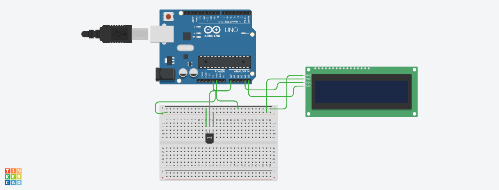

# Temperatura de ambiente

3Introdução
Este projeto foi desenvolvido no Tinkercad, como parte da disciplina de Internet das Coisas (IoT), com
o objetivo de criar um protótipo que simula um sistema de monitoramento de temperatura. O sistema utiliza
um sensor de temperatura analógico para capturar e exibir a temperatura ambiente em um display LCD.
O circuito é composto por um sensor de temperatura que lê os dados e uma tela LCD que apresenta as
informações em tempo real. O sistema é útil para aplicações onde o monitoramento contínuo da temperatura
é necessário.

# Componentes Usados

1 Arduino Uno
1 Placa de Ensaio
1 Sensor de Temperatura (analógico)
1 Módulo LCD I2C (16x2)
4 Jumpers Macho-Macho

#Montagem do Circuito

# Explicação do Código

 BIBLIOTECA LCD COM MÓDULO I2C
 
#include <LiquidCrystal_I2C.h>

 INICIALIZANDO LCD
 
LiquidCrystal_I2C telalcd(0x20, 16, 2);

 VARIÁVEL DO SENSOR DE TEMPERATURA
 
int sensorTMP = A0;  Pino do sensor de temperatura

 capturar temperatura
int valorLido;

void setup() {
     definir o sensor como entrada
    pinMode(sensorTMP, INPUT);
     ligar a tela LCD
    telalcd.init();
     limpar os dados que aparecem
    telalcd.clear();
     aumentar a luminosidade do LCD
    telalcd.backlight();
}

void loop() {
     capturar o valor da temperatura
    valorLido = analogRead(sensorTMP);
     converter valor de tensão
    float tensao = (valorLido * 5.0) / 1024.0;
     calcular a temperatura
    float temperatura = (tensao - 0.5) * 100;

   imprimir título "Temperatura" no LCD
    telalcd.setCursor(0, 0);
    telalcd.print("Temperatura"); // Adiciona o título

  imprimir valor da temperatura no LCD
  telalcd.setCursor(0, 1);
  telalcd.print(temperatura);
   telalcd.print(" C");
}
